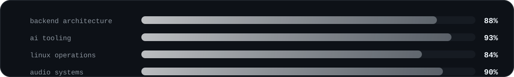

<p align="center">
  
</p>

<h1 align="center">PROGTRUM</h1>

<p align="center">
  <strong>AI Systems · Backend Engineering · Linux Infrastructure · Audio Technology</strong>
</p>

<p align="center">
  I build practical software systems where automation, neural models, infrastructure and sound design meet.
</p>

<p align="center">
  <a href="https://github.com/progtrum?tab=repositories">
    
  </a>
  <a href="https://t.me/progtrum">
    
  </a>
  
</p>

---

## Engineering Profile

```txt
SYSTEM      PROGTRUM_WORKSTATION
MODE        BUILD / RESEARCH / AUTOMATE
FOCUS       AI tooling, backend services, infrastructure scripts, creative audio systems
STACK       Python, FastAPI, Linux, Docker, SQL, Git, automation pipelines
SIGNAL      clean architecture, reliable deployment, measurable output
```

I am interested in tools that solve real problems: local AI assistants, backend APIs, automation panels, parsers, bots, monitoring utilities and interactive systems connected with music or sound.

<p align="center">
  
</p>

---

## Core Stack

<table>
  <tr>
    <td width="33%" valign="top">
      <h3>Backend</h3>
      <p>API design, application logic, service layers, async tasks, structured logging and predictable deployment.</p>
      <p>
        
        
        
      </p>
    </td>
    <td width="33%" valign="top">
      <h3>Infrastructure</h3>
      <p>Linux servers, reverse proxies, process management, CLI utilities, Git workflows and repeatable environments.</p>
      <p>
        
        
        
      </p>
    </td>
    <td width="33%" valign="top">
      <h3>AI / Automation</h3>
      <p>Local models, prompt systems, agents, data extraction, automation workflows and AI-assisted interfaces.</p>
      <p>
        
        
        
      </p>
    </td>
  </tr>
</table>

---

## Current Direction

<table>
  <tr>
    <td width="50%" valign="top">
      <h3>AI Engineering</h3>
      <ul>
        <li>Local AI services and model-backed tools</li>
        <li>Structured prompts and reliable output formats</li>
        <li>Knowledge search, brief generation and automation agents</li>
        <li>APIs that connect models with real business logic</li>
      </ul>
    </td>
    <td width="50%" valign="top">
      <h3>Software Systems</h3>
      <ul>
        <li>Backend panels and admin tools</li>
        <li>Parsers, bots and monitoring scripts</li>
        <li>Server deployment and infrastructure cleanup</li>
        <li>Audio-related experiments and creative interfaces</li>
      </ul>
    </td>
  </tr>
</table>

<p align="center">
  
</p>

---

## Featured Work Format

Use this block for pinned projects. Replace the repository links with real projects when they are ready.

<table>
  <tr>
    <td width="50%" valign="top">
      <h3>AI Console</h3>
      <p>Local assistant backend with API endpoints, session logic, prompt routing and structured responses.</p>
      <p><code>Python</code> <code>FastAPI</code> <code>Ollama</code> <code>SQLite</code></p>
      <a href="https://github.com/progtrum?tab=repositories">Open repositories</a>
    </td>
    <td width="50%" valign="top">
      <h3>Automation Lab</h3>
      <p>Scripts and utilities for operational tasks: parsing, server automation, cleanup tools and workflow acceleration.</p>
      <p><code>Python</code> <code>Linux</code> <code>CLI</code> <code>Git</code></p>
      <a href="https://github.com/progtrum?tab=repositories">Open repositories</a>
    </td>
  </tr>
  <tr>
    <td width="50%" valign="top">
      <h3>Audio Systems</h3>
      <p>Experiments at the border of music, synthesis, signal processing and interactive software.</p>
      <p><code>Audio</code> <code>DSP</code> <code>Python</code> <code>Creative Coding</code></p>
      <a href="https://github.com/progtrum?tab=repositories">Open repositories</a>
    </td>
    <td width="50%" valign="top">
      <h3>Web Infrastructure</h3>
      <p>Backend utilities, deployment scripts, content automation and technical tools for production websites.</p>
      <p><code>Backend</code> <code>SQL</code> <code>Nginx</code> <code>Automation</code></p>
      <a href="https://github.com/progtrum?tab=repositories">Open repositories</a>
    </td>
  </tr>
</table>

---

## Operating Principles

```txt
01. Build tools that can be used, not just demonstrated.
02. Prefer simple architecture until complexity is justified.
03. Make scripts repeatable, logs readable and errors actionable.
04. Keep interfaces sharp: clear input, clear output, no hidden magic.
05. Use AI as an engineering amplifier, not as a replacement for thinking.
```

---

## GitHub Signal

<p align="center">
  
  
</p>

<p align="center">
  
</p>

<p align="center">
  
</p>

---

## Contact

<p align="center">
  <a href="https://t.me/progtrum">
    
  </a>
</p>

<p align="center">
  
</p>

<p align="center">
  <sub>Software systems. Local AI. Infrastructure. Audio technology.</sub>
</p>
