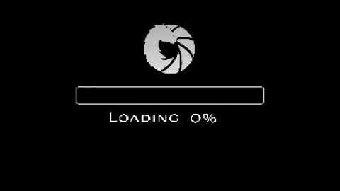
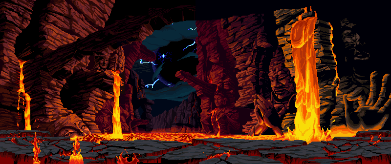
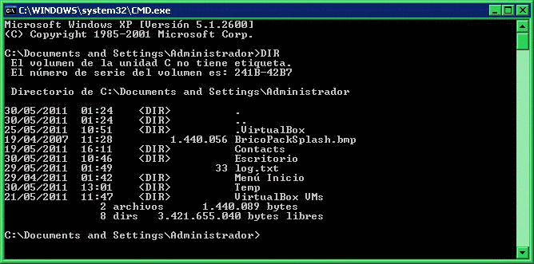
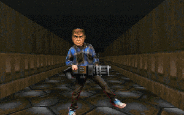

# 🔻 PROGTRUM OS // v.6.66 🔻

## *"Rip and Code in 8 bits."*

### 👾 SYSTEM PROFILE
User:      PROGTRUM  
Location:  Moscow, Sector H-13  
Occupation: Neural Engineer / Musician  
AI Kernel:  DOOMCORE v2.1  
Status:    ONLINE | 🔥 CPU Temp: 666°C  

---

### 🧠 NEURAL SYNTH INTERFACE

🎧 *Listening to the Sound of Hell...*

> “When sound becomes code, demons dance.”

---

### 💻 TERMINAL LOGS
> access /dev/hell_portal
> deploying neural firestorm...
> connection established [AI:DOOMCORE]
> synthesizing codewave...
> output: harmonic anomaly detected.
> [SUCCESS] demons are coding back.

---

### ⚙️ TOOLKIT

| Tool | Function | Power |
|:------:|:-------------|:------:|
| 🐍 Python | Core neural weapon | 💥💥💥💥💥 |
| ⚡ FastAPI | Gateway interface | 💥💥💥💥 |
| 💻 Linux | Operating layer | 💥💥💥 |
| 🧠 AI / ML | Neural essence | 💥💥💥💥💥 |
| 🎸 Audio Synthesis | Sonic warfare | 💥💥💥💥 |

---

🧠 Neural Computations: ██████████░░ 87%  
💀 Demons Eliminated: ████████████░ 93%  
🎵 Sound Engine Load: ████████████░ 91%  
🔥 Rage Level: ██████████████░░ 96%

---

### ☠️ CONNECT TO THE UNDERNET

 

<i>“The terminal never sleeps. The code never dies.”</i>

